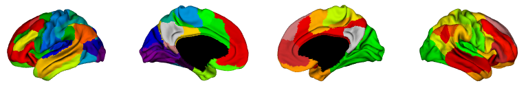
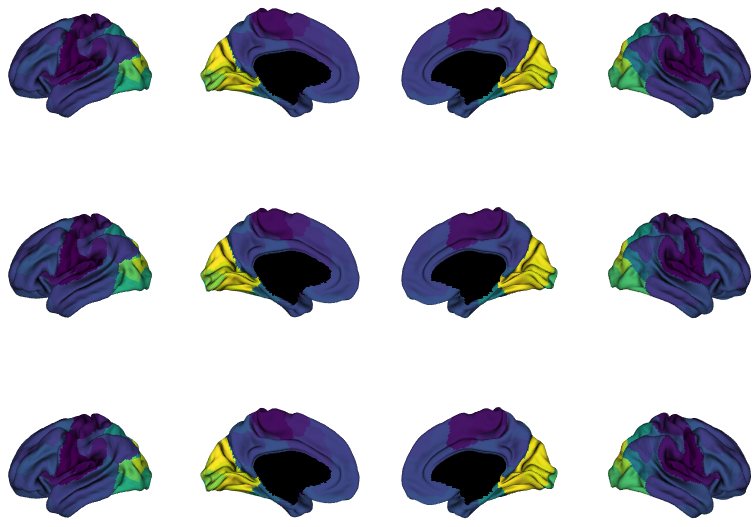
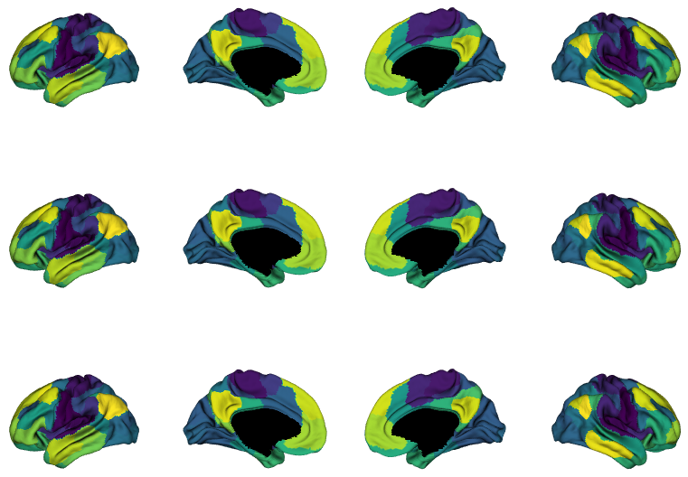

.. note::
    :class: sphx-glr-download-link-note

    Click :ref:`here <sphx_glr_download_auto_examples_plot_embedding_approaches.py>` to download the full example code
.. rst-class:: sphx-glr-example-title

.. _sphx_glr_auto_examples_plot_embedding_approaches.py:

Embedding approaches for gradient construction
=================================================
Starting from the resting state connectivity matrix built  from a subset of the
Human Connectome Project (HCP) dataset, we generate a sparse matrix and compute
its affinity matrix. In this example, we show how the affinity matrix is
decomposed using 3 different embedding approaches to obtain the gradients.

We will start by loading the all the data we need for this example. Instead of
using the original vertex-wise connectivity matrix, we are going to load a
100x100 matrix based on Schaefer et al., 2017 parcellation.

.. code-block:: default

    from brainspace.data.base import load_group_hcp, load_parcellation, load_conte69

    # First load mean connectivity matrix and Schaefer parcellation
    conn_matrix = load_group_hcp('schaefer', n_parcels=100)
    labeling = load_parcellation('schaefer', n_parcels=100)

    # and load the conte69 hemisphere surfaces
    surf_lh, surf_rh = load_conte69()

Let's see the parcellation. We are going to append the parcellation to the
hemispheres and plot them. Note that the parcellation is arranged such that
the first elements of the array correspond to the left hemisphere, and the
remaining to the right.

.. code-block:: default

    from brainspace.plotting import plot_hemispheres

    # Let's see the parcellation
    # first we are going to append the parcellation to the hemispheres
    n_pts_lh = surf_lh.n_points

    surf_lh.append_array(labeling[:n_pts_lh], name='Schaefer100', at='point')
    surf_rh.append_array(labeling[n_pts_lh:], name='Schaefer100', at='point')

    # then plot the data on the surface
    plot_hemispheres(surf_lh, surf_rh, array_name='Schaefer100', interactive=False,
                     embed_nb=True, size=(800, 200), cmap_name='nipy_spectral')

We can also see the connectivity matrix correlsponding to the 100
parcellations loaded above.

.. code-block:: default

    import matplotlib.pyplot as plt

    # The mean connectivity matrix built from the HCP data
    plt.imshow(conn_matrix, cmap='hot', interpolation='bilinear')
    ax = plt.gca()
    ax.xaxis.set_visible(False)
    ax.yaxis.set_visible(False)

.. * .. image:: /auto_examples/images/sphx_glr_plot_embedding_approaches_001.png
.. *     :class: sphx-glr-single-img

.. image:: ../python_doc/examples_figs/ex0_fig1.png
   :scale: 70%
   :align: center

Now, we compute the gradients using 3 different embedding approaches: PCA,
Laplacian embeddings (i.e., 'le') and Diffusion maps (i.e., 'dm')

.. code-block:: default

    import numpy as np

    from brainspace.gradient import GradientMaps
    from brainspace.utils.parcellation import map_to_labels

    # list of embedding approaches
    list_embedding = ['pca', 'le', 'dm']

    mask_cortex = labeling != 0

    for i, emb in enumerate(list_embedding):
        # We ask for 2 gradients
        gm = GradientMaps(n_gradients=2, approach=emb, kernel='normalized_angle',
                          random_state=0)

        # fit to the connectivity matrix
        gm.fit(conn_matrix)

        # append gradients to the surfaces
        for k in range(2):
            array_name = '{emb}_grad{k}'.format(emb=emb, k=k)
            grad = gm.gradients_[:, k]

            # map the gradient to the parcels (skip non-cortex)
            grad = map_to_labels(grad, labeling, mask=mask_cortex, fill=np.nan)

            # append to hemispheres
            # print("Appending '%s'" % array_name)
            surf_lh.append_array(grad[:n_pts_lh], name=array_name, at='point')
            surf_rh.append_array(grad[n_pts_lh:], name=array_name, at='point')

For each embedding approach, we compute 2 gradients and append them to the
left and right surfaces. Note that we have used 'normalized_angle' to build
the affinity matrix.

Next, for all embedding approaches, we display the first gradient

.. code-block:: default

    array_names = ['pca_grad0', 'le_grad0', 'dm_grad0']
    plot_hemispheres(surf_lh, surf_rh, array_name=array_names, interactive=False,
                     embed_nb=True, size=(800, 600), cmap_name='viridis')

And the second gradient

.. code-block:: default

    array_names = ['pca_grad1', 'le_grad1', 'dm_grad1']
    plot_hemispheres(surf_lh, surf_rh, array_name=array_names, interactive=False,
                     embed_nb=True, size=(800, 600), cmap_name='viridis')

We can see how the gradients follow the previously described
somatomotor-to-visual and defaultmode-to-sensory axes.

.. rst-class:: sphx-glr-timing

   **Total running time of the script:** ( 0 minutes  3.093 seconds)

.. _sphx_glr_download_auto_examples_plot_embedding_approaches.py:

.. only :: html

 .. container:: sphx-glr-footer
    :class: sphx-glr-footer-example

  .. container:: sphx-glr-download

     :download:`Download Python source code: plot_embedding_approaches.py <plot_embedding_approaches.py>`

  .. container:: sphx-glr-download

     :download:`Download Jupyter notebook: plot_embedding_approaches.ipynb <plot_embedding_approaches.ipynb>`

.. only:: html

 .. rst-class:: sphx-glr-signature

    `Gallery generated by Sphinx-Gallery <https://sphinx-gallery.github.io>`_
