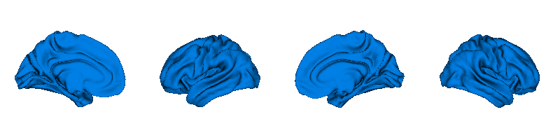

.. _getting_started:

Getting Started
==============================

BrainSpace offers a wide variety of approaches to build gradients. Here we are
going to through its main features and the basics to start using BrainSpace.

Let's start by loading the data:

.. tabs::

   .. code-tab:: py

        >>> from brainspace.data.base import load_conte69

        >>> # Load left and right hemisphere
        >>> surf_lh, surf_rh = load_conte69()
        >>> surf_lh.n_points
        32492

        >>> surf_rh.n_points
        32492

   .. code-tab:: matlab

         addpath('/path/to/micasoft/BrainSpace/matlab');
         pth = '/media/oualid/hd500/oualid/BrainSpace/brainspace_data/surfaces';
         surf_lh = convert_surface([pth filesep 'conte69_64k_left_hemisphere.gii']);
         surf_rh = convert_surface([pth filesep 'conte69_64k_right_hemisphere.gii']);
         size(surf_lh.coord,2)
         size(surf_rh.coord,2)

We can plot the surfaces:

.. tabs::

   .. code-tab:: py

        >>> from brainspace.plotting import plot_hemispheres
        >>> plot_hemispheres(surf_lh, surf_rh, interactive=False,
        ...                  embed_nb=True, size=(800, 200),
        ...                  color=(0, 0.5, 0.9))

   .. code-tab:: matlab

        plot_hemispheres(ones(64984,1),{surf_lh,surf_rh}); 

And also load the mean connectivity matrix built from a subset of HCP. The
package only comes with toy matrices resamples using Schaefer
(Schaefer et al., 2017) parcellations.

.. tabs::

   .. code-tab:: py

        >>> from brainspace.data.base import load_hcp_group
        >>> m = load_group_hcp('schaefer', n_parcels=400)
        >>> m.shape
        (400, 400)

   .. code-tab:: matlab

        tmp = load('my_data_file');
        m = tmp.name_of_my_data_field; 

To compute the gradients of `m`. Next, we create the `GradientMaps` object and
fit the model to our data:

.. tabs::

   .. code-tab:: py

        >>> from brainspace.gradient import GradientMaps

        >>> # create gradient mapper using diffusion maps and normalized angle
        >>> # gradients will be aligned using procrustes analysis
        >>> gm = GradientMaps(n_gradients=2, approach='dm', kernel='normalized_angle',
        ...                   align=None, random_state=0)

        >>> # and fit to the data
        >>> gm = gm.fit(m)
        GradientMaps(align=None, approach='dm', kernel='normalized_angle',
                     n_gradients=2, random_state=0)

        >>> # The gradients are in
        >>> gm.gradients_.shape
        (400, 2)

   .. code-tab:: matlab

        % Create gradient mapper using diffusion maps and normalized angle
        gm = GradientMaps('kernel','na','manifold',dm','n_components',2);

        % Fit the data with this gradient mapper.
        gm = gm.fit(m);

We can visually inspect the gradients:

.. tabs::

   .. code-tab:: py

        >>> n_pts_lh = surf_lh.n_points

        >>> # We need to append the first gradient to the left hemisphere
        >>> surf_lh.append_array(gm.gradients_[:n_pts_lh, 0], name='gradient1', at='points')

        >>> # and right hemisphere
        >>> surf_rh.append_array(gm.gradients_[n_pts_lh:, 0], name='gradient1', at='points')

        >>> # now, plotting
        >>> plot_hemispheres(surf_lh, surf_rh, array_name='gradient1',
        ...                  interactive=False, embed_nb=True, size=(800, 200))

   .. code-tab:: matlab
        % Plot the first gradient on the cortical surface. 
        plot_hemispheres(gm.gradients{1}(:,1), {surf_lh,surf_rh});

