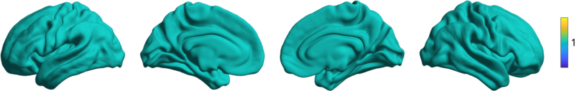
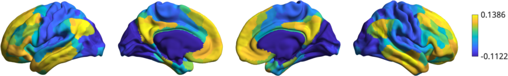

.. _gettingstarted:

Getting Started
==============================

BrainSpace offers a wide variety of approaches to build gradients. Here we will
go through the basics to start using BrainSpace.

Let's start by loading the data:

.. tabs::

   .. code-tab:: py

        >>> from brainspace.datasets import load_conte69

        >>> # Load left and right hemispheres
        >>> surf_lh, surf_rh = load_conte69()
        >>> surf_lh.n_points
        32492

        >>> surf_rh.n_points
        32492

   .. code-tab:: matlab

        addpath('/path/to/micasoft/BrainSpace/matlab');

        % Load left and right hemispheres
        [surf_lh, surf_rh] = load_conte69();

We can plot the surfaces:

.. tabs::

   .. code-tab:: py

        >>> from brainspace.plotting import plot_hemispheres
        >>> plot_hemispheres(surf_lh, surf_rh, interactive=False,
        ...                  embed_nb=True, size=(800, 200))

   .. code-tab:: matlab

        plot_hemispheres(ones(64984,1),{surf_lh,surf_rh}); 

Let's load a mean functional connectivity matrix built from a subset of the Human
Connectome Project Young Adult cohort. This package comes with connectivity
matrices subdivided based on functional parcellations `(Schaefer et al., 2017)
<https://academic.oup.com/cercor/article/28/9/3095/3978804>`_. 

.. tabs::

   .. code-tab:: py

        >>> from brainspace.datasets import load_group_hcp
        >>> m = load_group_hcp('schaefer', n_parcels=400)
        >>> m.shape
        (400, 400)

   .. code-tab:: matlab

        labeling = load_parcellation('schaefer',400);
        conn_matices = load_group_hcp('schaefer',400);
        m = conn_matices.schaefer_400; 

To compute the gradients of `m` we create the `GradientMaps` object and
fit the model to our data:

.. tabs::

   .. code-tab:: py

        >>> from brainspace.gradient import GradientMaps

        >>> # Build gradients using diffusion maps and normalized angle
        >>> gm = GradientMaps(n_gradients=2, approach='dm',
        ...                   kernel='normalized_angle', random_state=0)

        >>> # and fit to the data
        >>> gm = gm.fit(m)
        GradientMaps(alignment=None, approach='dm', kernel='normalized_angle',
                     n_gradients=2, random_state=0)

        >>> # The gradients are in
        >>> gm.gradients_.shape
        (400, 2)

   .. code-tab:: matlab

        % Build gradients using diffusion maps and normalized angle
        gm = GradientMaps('kernel','na','approach','dm','n_components',2);

        % and fit to the data
        gm = gm.fit(m);

Let's plot the first gradient.

.. tabs::

   .. code-tab:: py

        >>> # Plot first gradient on the cortical surface.
        >>> plot_hemispheres(surf_lh, surf_rh, array_name=gm.gradients_[:, 0],
        ...                  interactive=False, embed_nb=True, size=(800, 200))

   .. code-tab:: matlab

        % Plot the first gradient on the cortical surface.
        plot_hemispheres(gm.gradients{1}(:,1), {surf_lh,surf_rh});

