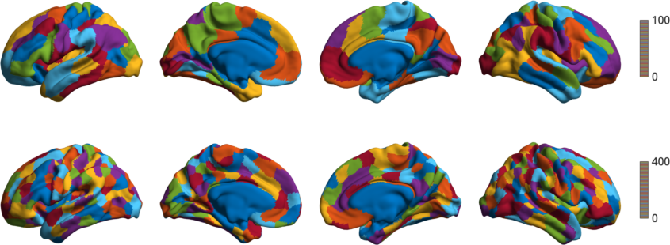
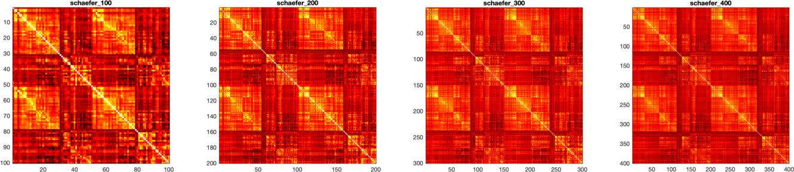
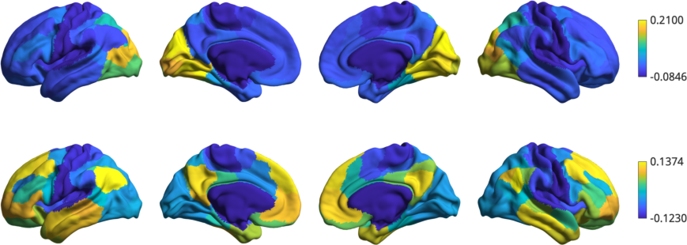
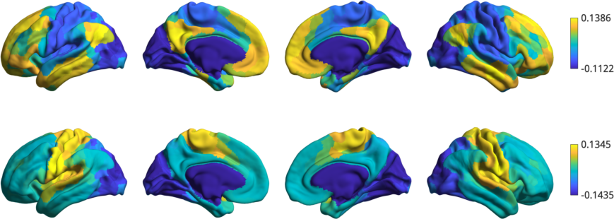

Functional gradients across spatial scales
=================================================
To assess consistency of gradient mapping, in this example we will compute the gradients across different spatial scales. Specifically we subdivide the conte69 surface into 100, and 400 parcels based on a functional clustering `(Schaefer et al., 2017) <https://academic.oup.com/cercor/article-lookup/doi/10.1093/cercor/bhx179>`_ and built functional gradients from these representations.

First, let's load the different parcellations and their corresponding mean connectivity matrices. We also load the conte69 surface. These files are provided with BrainSpace.

.. code-block:: matlab

    addpath(genpath('/path/to/BrainSpace/matlab')); 

    % Different parcellations
    list_parcels = [100,400]; 

    % Load parcellations and mean connectivity matrices
    labelings = load_parcellation('schaefer',list_parcels); 
    conn_matices = load_group_hcp('schaefer',list_parcels);
    
    % and load the conte69 hemisphere surfaces
    [surf_lh,surf_rh] = load_conte69();

Let's see the different parcellations of the surface. We have to append the
parcellations to the left and right hemispheres first.

.. code-block:: matlab

    h = plot_hemispheres([labelings.schaefer_100,labelings.schaefer_400], ...
                        {surf_lh,surf_rh});
    colormap(h.figure,lines(401))

We have 2 mean connectivity matrices built from each parcellation.

.. code-block:: matlab

    h = struct();
    parcel_names = fieldnames(conn_matices);
    titles = replace(parcel_names,'_','\_');

    % The mean connectivity matrix built from the HCP data for each parcellation
    h.fig = figure('Color','w');
    for ii = 1:numel(parcel_names)
        h.ax(ii) = subplot(1,2,ii);
        h.img(ii) = imagesc(conn_matices.(parcel_names{ii}));
        title(titles{ii})
        axis square
        colormap hot
    end

Now, we use our GradientMaps class to build one gradient for each connectivity matrix. Gradients are the appended to the surfaces.

.. code-block:: matlab

    % Fit a gradient for each parcellation scheme. 
    gm = GradientMaps('kernel','normalized angle', ...
                      'approach','diffusionembedding');
    gm = gm.fit(struct2cell(conn_matices));

Finally, we plot the first two gradient of Schaefer_100 as follows:

.. code-block:: matlab
    
   plot_hemispheres(gm.gradients{1}(:,1:2),{surf_lh,surf_rh},labelings.schaefer_100);

and the first two gradients of Schaefer_400.

.. code-block:: matlab
    
    plot_hemispheres(G.gradients{2}(:,1:2),{surf_lh,surf_rh},labelings.schaefer_400);

