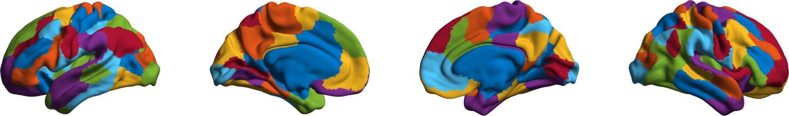
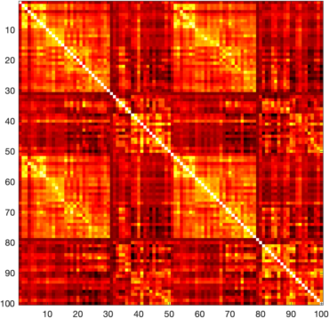
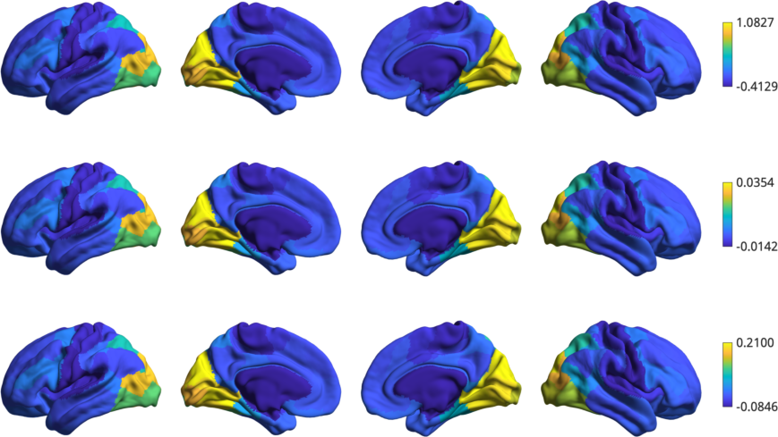
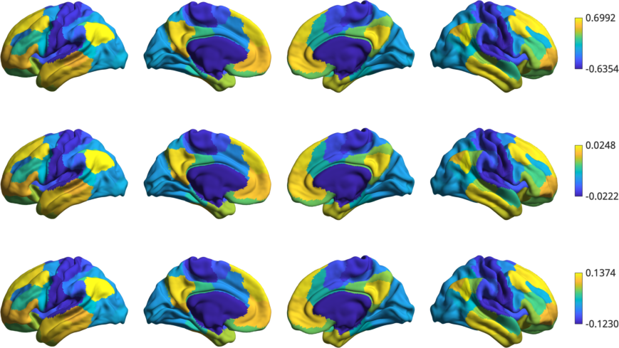

Embedding approaches for gradient construction
=================================================
Starting from the resting state connectivity matrix built  from a subset of the Human Connectome Project (HCP) dataset, we generate a sparse matrix and compute its affinity matrix. In this example, we show how the affinity matrix is decomposed using 3 different embedding approaches to obtain the gradients.

We will start by loading the all the data we need for this example. Instead of using the original vertex-wise connectivity matrix, we are going to load a 100x100 matrix based on the `Schaefer et al., 2017 <https://academic.oup.com/cercor/article-lookup/doi/10.1093/cercor/bhx179>`_ parcellation.

.. code-block:: matlab

    addpath(genpath('/path/to/BrainSpace/matlab')); 

    % First load mean connectivity matrix and Schaefer parcellation
    conn_matrix = load_group_hcp('schaefer',100);
    labeling = load_parcellation('schaefer',100);

    % The loader functions output data in a struct array for when you 
    % load multiple parcellations. Lets just bring them to numeric arrays.
    conn_matrix = conn_matrix.schaefer_100;
    labeling = labeling.schaefer_100;

    % and load the conte69 hemisphere surfaces
    [surf_lh, surf_rh] = load_conte69();

Let's see the parcellation on the surface. 

.. code-block:: matlab

   h = plot_hemispheres(labelings.schaefer_100, {surf_lh,surf_rh});
   colormap(h.figure,lines(101))

We can also see the connectivity matrix corresponding to the 100
parcellations loaded above.

.. code-block:: matlab

    # The mean connectivity matrix built from the HCP data
    figure('Color','w');
    imagesc(conn_matrix);
    axis square; colormap(hot);

Now, we compute the gradients using 3 different embedding approaches: PCA,
Laplacian embeddings (i.e., 'le') and Diffusion maps (i.e., 'dm')

.. code-block:: matlab

    embeddings = {'pca','le','dm'};
    for ii = 1:numel(embeddings)
        gm{ii} = GradientMaps('kernel','na','approach',embeddings{ii});
        gm{ii} = gm{ii}.fit(conn_matrix); 
    end

Next, for all embedding approaches, we display the first gradient.

.. code-block:: matlab

    h2 = plot_hemispheres([gm{1}.gradients{1}(:,1), ...
                           gm{2}.gradients{1}(:,1), ...
                           gm{3}.gradients{1}(:,1)], ...
                           {surf_lh,surf_rh}, ...
                           labeling);

And the second gradient

.. code-block:: matlab

    h2 = plot_hemispheres([gm{1}.gradients{1}(:,2), ...
                           gm{2}.gradients{1}(:,2), ...
                           gm{3}.gradients{1}(:,2)], ...
                           {surf_lh,surf_rh}, ...
                           labeling);  

We can see how the gradients follow the previously described
somatomotor-to-visual and defaultmode-to-sensory axes.
