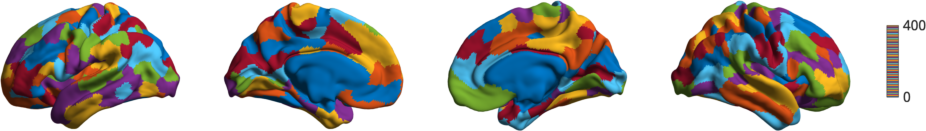
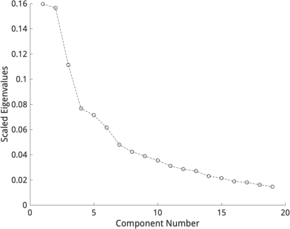
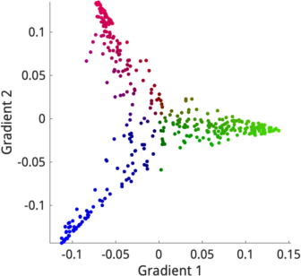
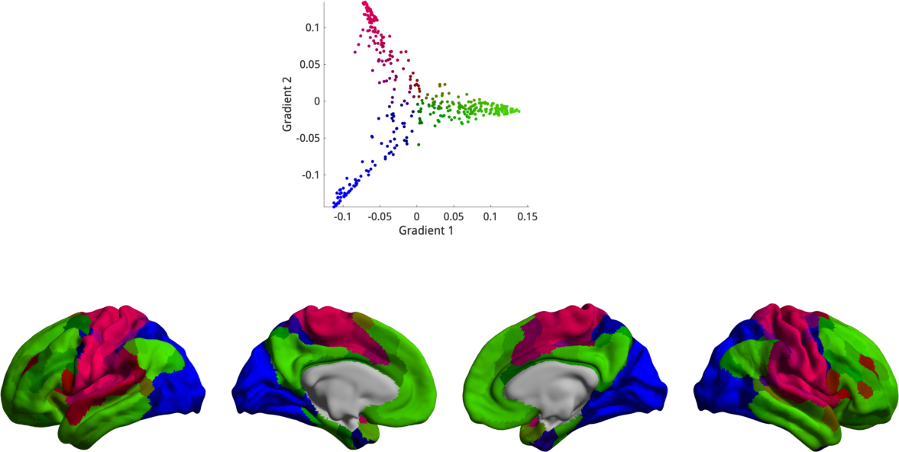

Tutorial 1: Building your first gradient
=================================================

In this example, we will derive a gradient and do some basic inspections to
determine which gradients may be of interest and what the multidimensional
organization of the gradients looks like.

We'll first start by loading some sample data. Note that we're using parcellated
data for computational efficiency.

.. code-block:: matlab

    addpath(genpath('/path/to/BrainSpace/matlab'));

    % First load mean connectivity matrix and Schaefer parcellation
    conn_matrix = load_group_fc('schaefer',400);
    labeling = load_parcellation('schaefer',400);

    % The loader functions output data in a struct array for when you
    % load multiple parcellations. Let's just bring them to numeric arrays.
    conn_matrix = conn_matrix.schaefer_400;
    labeling = labeling.schaefer_400;

    % and load the conte69 hemisphere surfaces
    [surf_lh, surf_rh] = load_conte69();

Let's first look at the parcellation scheme we're using. 

.. code-block:: matlab    
    
    h = plot_hemispheres(labeling, {surf_lh,surf_rh});
    colormap(h.figure,lines(401))

and let's construct our gradients. 

.. code-block:: matlab

    % Construct the gradients
    gm = GradientMaps();
    gm = gm.fit(conn_matrix);

Note that the default parameters (normalized angle kernel, diffusion embedding
approach, 10 components) will be reported in the console. Once you have your
gradients a good first step is to simply inspect what they look like. Let's have
a look at the first two gradients.

.. code-block:: matlab

    plot_hemispheres(gm.gradients{1}(:,1:2),{surf_lh,surf_rh}, ...
                 'parcellation', labeling, ...
                 'labeltext',{'Gradient 1','Gradient 2'});

.. image:: ./example_figs/g1-2_schaefer_400_v2.png
    :scale: 70%
    :align: center

But which gradients should you keep for your analysis? In some cases you may
have an a-priori interest in some previously defined set of gradients. When you
don not have a pre-defined set, you can instead look at the lambdas
(eigenvalues) of each component in a scree plot. Higher eigenvalues (or lower in
laplacian eigenmapping) are more important, so one can choose a cut-off based on
a scree plot.

.. code-block:: matlab

    scree_plot(gm.lambda{1});

A reasonable choice based on this scree plot would be to focus on the first two
gradients as they provide a good trade-off between keeping few components whilst
retaining a large amount of variance.

Inspecting gradients together can be quite informative. BrainSpace provides
tools for plotting a set of gradients in 2D or 3D space, and assigning them
colors based on their position. This color can then be propagated to the surface
to get an idea of the multidimensional interaction between the gradients. You do
this as follows:

.. code-block:: matlab

    gradient_in_euclidean(gm.gradients{1}(:,1:2));

We can see that the values of each region are relatively clustered along three
lines, colored here in red, green, and blue. If we want to put these colors on
the cortical surface, we simply provide the same function with the surface (and
parcellation if using parcellated data).

.. code-block:: matlab

    gradient_in_euclidean(gm.gradients{1}(:,1:2),{surf_lh,surf_rh},labeling);

It now becomes quite evident that the three lines we see in the scatter plot
correspond to the somatomotor (red), default mode (green) and visual (blue)
networks.

This concludes the first tutorial. In the next tutorial we will have a look at
how to customize the methods of gradient estimation, as well as gradient
alignments.
