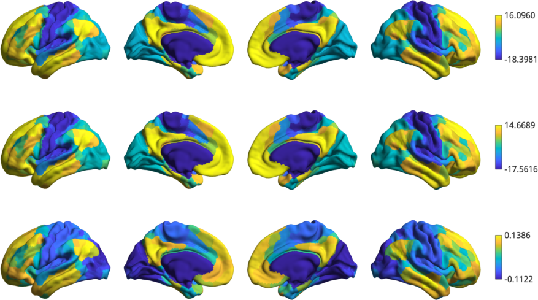
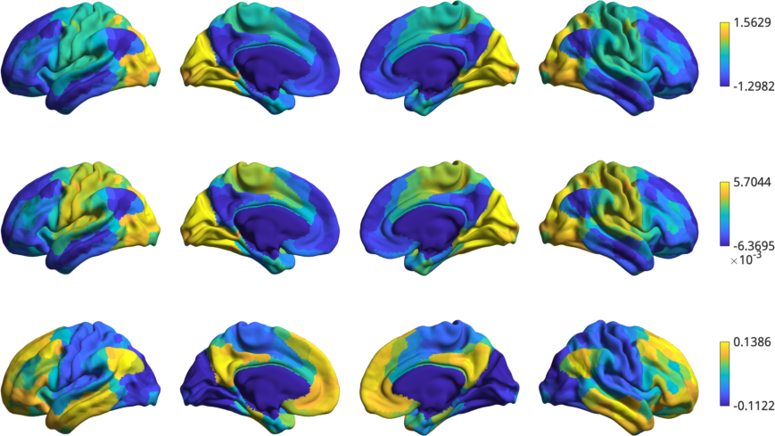
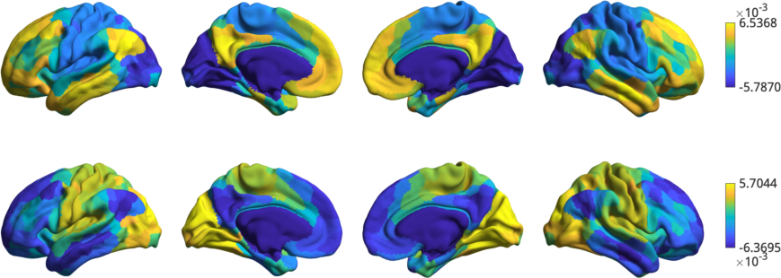
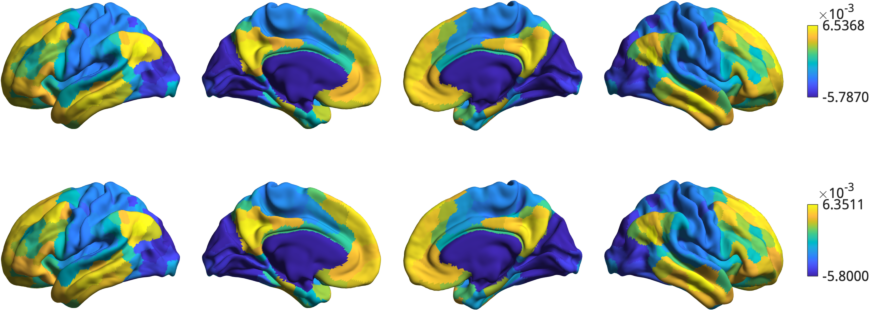
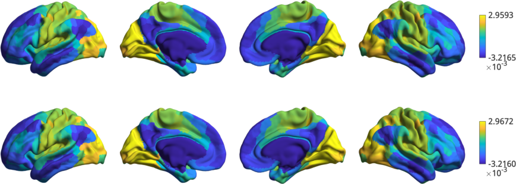

Tutorial 2: Customizing and aligning gradients
=====================================================

In this tutorial you'll learn about the methods available within the
``GradientMaps`` class. The flexible usage of this class allows for the
customization of gradient computation with different kernels and dimensionality
reductions, as well as aligning gradients from different datasets. This tutorial
will only show you how to apply these techniques, for in-depth descriptions we
recommend you read the main manuscript [[ADD HYPERLINK]]. 

As before, we'll start by loading the sample data.

.. code-block:: matlab    

    addpath(genpath('/Users/reinder/Github/BrainSpace/matlab'));
    
    % First load mean connectivity matrix and Schaefer parcellation
    conn_matrix = load_group_fc('schaefer',400);
    labeling = load_parcellation('schaefer',400);
    
    % The loader functions output data in a struct array for when you
    % load multiple parcellations. Let's just bring them to numeric arrays.
    conn_matrix = conn_matrix.schaefer_400;
    labeling = labeling.schaefer_400;
    
    % and load the conte69 hemisphere surfaces
    [surf_lh, surf_rh] = load_conte69();
    
The ``GradientMaps`` object allows for many different kernels and dimensionality
reduction techniques (for a full list see :ref:`GradientMaps`). Let's have a look
at three different kernels.
    
.. code-block:: matlab    
    
    kernels = {'pearson', ...
               'spearman', ...
               'normalizedAngle'}; % Case-insensitive
    for ii = 1:numel(kernels)
        gm_k{ii} = GradientMaps('kernel',kernels{ii},'approach','dm');
        gm_k{ii} = gm_k{ii}.fit(conn_matrix);
    end
    
    plot_hemispheres([gm_k{1}.gradients{1}(:,1), ...
        gm_k{2}.gradients{1}(:,1), ...
        gm_k{3}.gradients{1}(:,1)], ...
        {surf_lh,surf_rh}, ...
        'parcellation', labeling);
    

It seems the gradients provided by these kernels are quite similar although
their scaling is quite different. Do note that the gradients are in arbitrary
units, so the smaller/larger axes across kernels do not imply anything. Similar
to using different kernels, we can also use different dimensionality reduction
techniques. 
 
.. code-block:: matlab    
    
    embeddings = {'principalComponentanAnalysis', ...
                  'laplacianEigenmap', ...
                  'diffusionEmbedding'}; % case-insensitve
    for ii = 1:numel(embeddings)
        gm_m{ii} = GradientMaps('kernel','na','approach',embeddings{ii});
        gm_m{ii} = gm_m{ii}.fit(conn_matrix);
    end
    
    plot_hemispheres([gm_m{1}.gradients{1}(:,1), ...
        gm_m{2}.gradients{1}(:,1), ...
        gm_m{3}.gradients{1}(:,1)], ...
        {surf_lh,surf_rh}, ...
        'parcellation', labeling);
    

Here we do see some substantial differences: PCA appears to find a slightly
different axis, with the somatomotor in the middle between default mode and
visual, whereas LE and DM both find the canonical first gradient but their signs
are flipped! Fortunately, the sign of gradients is arbitrary, so we could simply
multiply either the LM and DM gradient by -1 to make them more comparable. 

A more principled way of increasing comparability across gradients are alignment
techniques. BrainSpace provides two alignment techniques: Procrustes analysis,
and joint alignment. For this example we will load functional connectivity data
of a second subject group and align it with the first group.  

.. code-block:: matlab    
    
    conn_matrix2 = load_group_fc('schaefer',400,'holdout');
    Gp = GradientMaps('kernel','na','manifold','le','alignment','pa');
    Gj = GradientMaps('kernel','na','manifold','le','alignment','ja');
    
    Gp = Gp.fit({conn_matrix2,conn_matrix});
    Gj = Gj.fit({conn_matrix2,conn_matrix});

Here, ``Gp`` contains the Procrustes aligned data and ``Gj`` contains the joint
aligned data. Let's plot them, but in separate figures to keep things organized.

.. code-block:: matlab    
    
    plot_hemispheres({Gp.gradients{1}(:,1),Gp.gradients{2}(:,1)}, ...
        {surf_lh,surf_rh}, 'parcellation', labeling);
    

.. code-block:: matlab    
    
    h1 = plot_hemispheres({Gp.aligned{1}(:,1),Gp.aligned{2}(:,1)}, ...
        {surf_lh,surf_rh},labeling);
    h1.figure.Name = 'Procrustes';
    

    
.. code-block:: matlab    
    
    h2 = plot_hemispheres({Gj.aligned{1}(:,1),Gj.aligned{2}(:,1)}, ...
        {surf_lh,surf_rh},'parcellation',labeling);
    h2.figure.Name = 'Joint';
    
    

Before gradient alignment, the first gradient is reversed, but both alignments
resolve this issue. If the input data was less similar, alignments may also
resolve changes in the order of the gradients. However, you should always
inspect the output of an alignment; if the input data are sufficiently dissimilar
then the alignment may produce odd results.

That concludes the second tutorial. In the third tutorial we will consider null
hypothesis testing of comparisons between gradients and other markers. 

