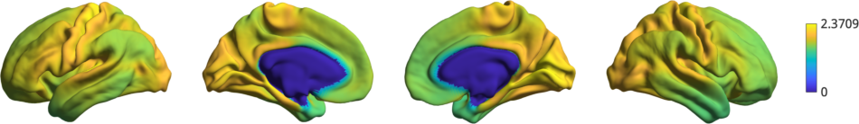
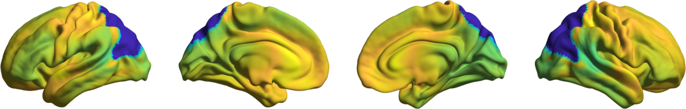

Tutorial 3: Null models for gradient significance
==================================================

In this tutorial we assess the significance of correlations between the first
canonical gradient and data from other modalities (curvature, cortical thickness
and T1w/T2w image intensity). A normal test of the significance of the
correlation cannot be used, because the spatial auto-correlation in MRI data may
bias the test statistic. In this tutorial we will show two approaches for null
hypothesis testing: spin permutations and Moran spectral randomization. 

.. note:: 
    When using either approach to compare gradients to non-gradient markers, we
    recommend randomizing the non-gradient markers as these randomizations need not
    maintain the statistical independence between gradients.

Spin Permutations
--------------------
Here, we use the spin permutations approach previously proposed in
`(Alexander-Bloch et al., 2018)
<https://www.sciencedirect.com/science/article/pii/S1053811918304968>`_, which
preserves the auto-correlation of the permuted feature(s) by rotating the
feature data on the spherical domain. 
We will start by loading the conte69 surfaces for left and right hemispheres,
their corresponding spheres, midline mask, and t1w/t2w intensity as well as
cortical thickness data, and a template functional gradient.

.. code-block:: matlab

    addpath(genpath('/path/to/BrainSpace/matlab')); 

    % load the conte69 hemisphere surfaces and spheres
    [surf_lh, surf_rh] = load_conte69;
    [sphere_lh, sphere_rh] = load_conte69('spheres');

    % Load the data 
    [t1wt2w_lh,t1wt2w_rh] = load_marker('t1wt2w');
    [thickness_lh,thickness_rh] = load_marker('thickness');
    
    % Template functional gradient
    embedding = load_gradient('fc',1);
    
Let's first generate some null data using spintest. 

.. code-block:: matlab

    % Let's create some rotations
    n_permutations = 1000;
    y_rand = spin_permutations({[t1wt2w_lh,thickness_lh],[t1wt2w_rh,thickness_rh]}, ...
                      {sphere_lh,sphere_rh}, ...
                      n_permutations,'random_state',0);

    % Merge the rotated data into single vectors
    t1wt2w_rotated = squeeze([y_rand{1}(:,1,:); y_rand{2}(:,1,:)]);
    thickness_rotated = squeeze([y_rand{1}(:,2,:); y_rand{2}(:,2,:)]);

As an illustration of the rotation, let's plot the original t1w/t2w data

.. code-block:: matlab
 
    % Plot original data
    h1 = plot_hemispheres([t1wt2w_lh;t1wt2w_rh],{surf_lh,surf_rh});

as well as a few rotated version.

.. code-block:: matlab

    % Plot a few of the rotations
    h2 = plot_hemispheres(t1wt2w_rotated(:,1:3),{surf_lh,surf_rh});

.. warning:: 
    Depending on the overlap of midlines (i.e. NaNs) in the original 
    data and in the rotation, statistical comparisons between them may compare
    different numbers of features. This can bias your test statistics. Therefore, if
    a large portion of the sphere is not used, we recommend using Moran spectral
    randomization instead.  

Now we simply compute the correlations between the first gradient and the
original data, as well as all rotated data.

.. code-block:: matlab

    % Find correlation between FC-G1 with thickness and T1w/T2w
    [r_original_thick, pval_thick_spin] = corr(embedding,[thickness_lh;thickness_rh], ...
                    'rows','pairwise','type','spearman');
    % Original p-value: 0. 
    r_rand_thick = corr(embedding,thickness_rotated, ...
                'rows','pairwise','type','spearman');
    [r_original_t1wt2w, pval_t1wt2w_spin] = corr(embedding,[t1wt2w_lh;t1wt2w_rh], ...
                    'rows','pairwise','type','spearman');
    % Original p-value: 0. 
    r_rand_t1wt2w = corr(embedding,t1wt2w_rotated, ...
                'rows','pairwise','type','spearman');
          
          
To find a p-value, we simply compute the percentile rank of the true correlation
in the distribution or random correlations. Assuming a threshold of p<0.05 for
statistical significance and disregarding multiple comparison corrections, we
consider the correlation to be significant if it is lower or higher than the
2.5th/97.5th percentile, respectively. 

.. code-block:: matlab

   % Compute percentile rank.
    prctile_rank_thick = mean(r_original_thick > r_rand_thick); 
    % Percentile rank = 0.9410
    significant_thick = prctile_rank_thick < 0.025 || prctile_rank_thick >= 0.975;

    prctile_rank_t1wt2w = mean(r_original_t1wt2w > r_rand_t1wt2w); 
    % Percentile rank = 0 
    significant_t1wt2w = prctile_rank_t1wt2w < 0.025 || prctile_rank_t1wt2w >= 0.975;

If significant is true, then we have found a statistically significant
correlation. Alternatively, one could also test the one-tailed hypothesis
whether the percentile rank is lower or higher than the 5th/95th percentile,
respectively.

Moran Spectral Randomization 
--------------------------------

Moran Spectral Randomization (MSR) computes Moran's I, a metric for spatial
auto-correlation and generates normally distributed data with similar
auto-correlation. MSR relies on a weight matrix denoting the spatial proximity
of features to one another. Within neuroimaging, one straightforward example of
this is inverse geodesic distance i.e. distance along the cortical surface. 

In this example we will show how to use MSR to assess statistical significance
between cortical markers (here curvature and cortical t1wt2w intensity) and the
first functional connectivity gradient. We will start by loading the conte69
surfaces for left and right hemispheres, a left temporal lobe mask, t1w/t2w
intensity as well as cortical thickness data, and a template functional
gradient. 

.. code-block:: matlab

    addpath(genpath('/path/to/BrainSpace/matlab')); 

    % load the conte69 hemisphere surfaces and spheres
    [surf_lh, surf_rh] = load_conte69();

    % Load the data 
    t1wt2w_lh = load_marker('t1wt2w');
    curv_lh = load_marker('curvature');

    % Load mask
    temporal_mask_tmp = load_mask('temporal');

    % There's a one vertex overlap between the HCP midline mask (i.e. nans) and
    % our temporal mask.
    temporal_mask_lh = temporal_mask_tmp & ~isnan(t1wt2w_lh);

    % Load the embedding
    embedding = load_gradient('fc',1);
    embedding_lh = embedding(1:end/2);

    % Keep only the temporal lobe. 
    embedding_tl = embedding(temporal_mask_lh);
    t1wt2w_tl = t1wt2w_lh(temporal_mask_lh);
    curv_tl = curv_lh(temporal_mask_lh);

We will now compute the Moran eigenvectors. This can be done either by providing
a weight matrix of spatial proximity between each vertex, or by providing a
cortical surface (see also: :ref:`compute_mem_matlab`). Here we'll use a cortical
surface.

.. code-block:: matlab

    n_ring = 1; 
    MEM = compute_mem(surf_lh,'n_ring',n_ring,'mask',~temporal_mask_lh);

Using the Moran eigenvectors we can now compute the randomized data. As the
computationally intensive portion of MSR is mostly in :ref:`compute_mem_matlab`, we can
push the number of permutations a bit further. 

.. code-block:: matlab

    n_rand = 10000;
    y_rand = moran_randomization([curv_tl,t1wt2w_tl],MEM,n_rand, ...
        'procedure','singleton','joint',true,'random_state',0);

    curv_rand = squeeze(y_rand(:,1,:));
    t1wt2w_rand = squeeze(y_rand(:,2,:));

Now that we have the randomized data, we can compute correlations between the
gradient and the real/randomized data.  

.. code-block:: matlab

    [r_original_curv,pval_curv_moran] = corr(embedding_tl,curv_tl,'type','spearman');
    % Original p-value: 6.6380e-05
    r_rand_curv = corr(embedding_tl,curv_rand,'type','spearman');

    [r_original_t1wt2w,pval_t1wt2w_moran] = corr(embedding_tl,t1wt2w_tl,'type','spearman');
    % Original p-value: 0
    r_rand_t1wt2w = corr(embedding_tl,t1wt2w_rand,'type','spearman');

To find a p-value, we simply compute the percentile rank of the true correlation
in the distribution or random correlations. Assuming a threshold of p<0.05 for
statistical significance and disregarding multiple comparison corrections, we
consider the correlation to be significant if it is lower or higher than the
2.5th/97.5th percentile, respectively. 

.. code-block:: matlab

    prctile_rank_curv = mean(r_original_curv > r_rand_curv); 
    % Percentile rank = 0.8249
    significant_curv = prctile_rank_curv < 0.025 || prctile_rank_curv >= 0.975;

    prctile_rank_t1wt2w = mean(r_original_t1wt2w > r_rand_t1wt2w); 
    % Percentile rank = 0
    significant_t1wt2w = prctile_rank_t1wt2w < 0.025 || prctile_rank_t1wt2w >= 0.975;

If significant is true, then we have found a statistically significant
correlation. Alternatively, one could also test the one-tailed hypothesis
whether the percentile rank is lower or higher than the 5th/95th percentile,
respectively.

This concludes the third and last tutorial. You should now be familliar with all
the functionality of the BrainSpace toolbox. For more details on any specific
function, please see :ref:`matlab_package`.
