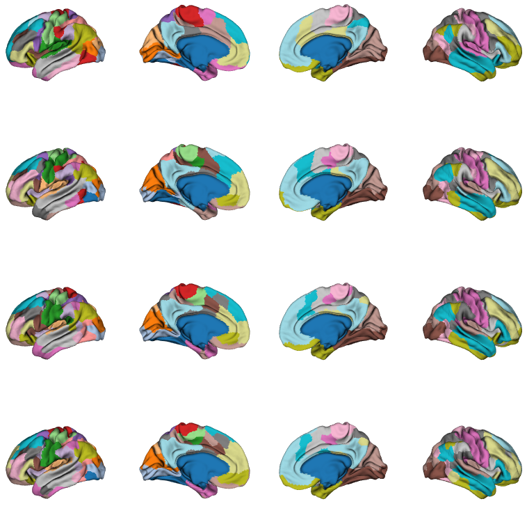
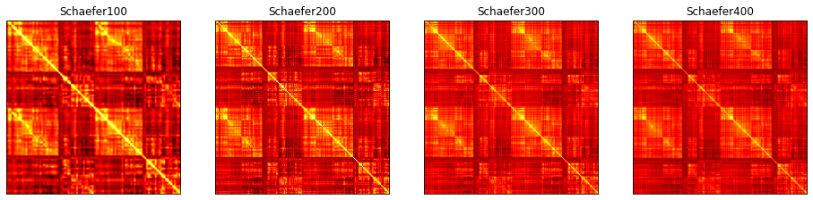
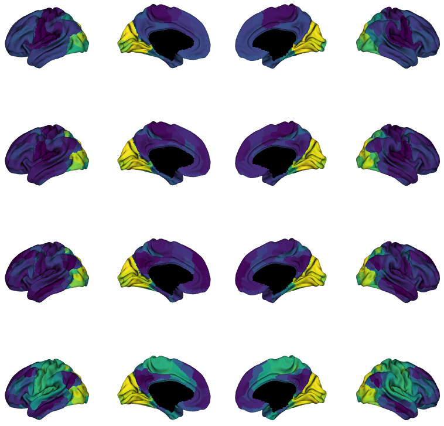

.. note::
    :class: sphx-glr-download-link-note

    Click :ref:`here <sphx_glr_download_auto_examples_plot_different_parcellations.py>` to download the full example code
.. rst-class:: sphx-glr-example-title

.. _sphx_glr_auto_examples_plot_different_parcellations.py:

Functional gradients across spatial scales
=================================================
To assess consistency of gradient mapping, in this example we will compute the
gradients across different spatial scales. Specifically we subdivide the conte69
surface into 100, 200, 300, and 400 parcels based on a functional clustering
(Schaefer et al., 2017) and built functional gradients from these
representations.

First, let's load the different parcellations (Schaefer et al., 2017) and
their corresponding mean connectivity matrices. We also load the conte69
surface. These files are provided with BrainSpace.

.. code-block:: default

    from brainspace.data.base import load_group_hcp, load_parcellation, load_conte69

    # Different parcellations
    list_parcels = [100, 200, 300, 400]

    # Load parcellations and mean connectivity matrices
    labelings = [load_parcellation('schaefer', n_parcels=n) for n in list_parcels]
    conn_matrices = [load_group_hcp('schaefer', n_parcels=n) for n in list_parcels]

    # and load the conte69 hemisphere surfaces
    surf_lh, surf_rh = load_conte69()

Let's see the different parcellations of the surface. We have to append the
parcellations to the left and right hemispheres first.

.. code-block:: default

    from brainspace.plotting import plot_hemispheres

    n_pts_lh = surf_lh.n_points
    n_parcellations = len(list_parcels)

    # first we are going to append the parcellation to the hemispheres
    name_parcels = [None] * n_parcellations
    for i, np in enumerate(list_parcels):
        array_name = 'Schaefer{0}'.format(np)
        name_parcels[i] = array_name

        surf_lh.append_array(labelings[i][:n_pts_lh], name=array_name, at='p')
        surf_rh.append_array(labelings[i][n_pts_lh:], name=array_name, at='p')

    # Then plot the data on the surface
    plot_hemispheres(surf_lh, surf_rh, array_name=name_parcels, interactive=False,
                     embed_nb=True, size=(800, 800), cmap_name='tab20')

We have 4 mean connectivity matrices built from each parcellation.

.. code-block:: default

    import matplotlib.pyplot as plt

    fig, ax = plt.subplots(1, n_parcellations, figsize=(10, 25))

    # The mean connectivity matrix built from the HCP data for each parcellation
    for i in range(n_parcellations):
        ax[i].imshow(conn_matrices[i], cmap='hot', interpolation='bilinear')

        ax[i].set_title(name_parcels[i])
        ax[i].xaxis.set_visible(False)
        ax[i].yaxis.set_visible(False)

Now, we use our GradientMaps class to build one gradient for each connectivity
matrix. Gradients are the appended to the surfaces.

.. code-block:: default

    import numpy as np

    from brainspace.gradient import GradientMaps
    from brainspace.utils.parcellation import map_to_labels

    name_gradients = [None] * n_parcellations
    for i, cm in enumerate(conn_matrices):
        # We ask for 2 gradients
        gm = GradientMaps(n_gradients=1, approach='dm', kernel='normalized_angle',
                          random_state=0)

        # fit to the connectivity matrix
        gm.fit(cm)

        # append gradients to the surfaces
        array_name = 'grad0_Schaefer{0}'.format(list_parcels[i])
        name_gradients[i] = array_name
        grad = gm.gradients_[:, 0]

        # map the gradient to the parcels
        grad = map_to_labels(grad, labelings[i], mask=labelings[i] != 0,
                             fill=np.nan)

        # append to hemispheres
        print("Appending '%s'" % array_name)
        surf_lh.append_array(grad[:n_pts_lh], name=array_name, at='p')
        surf_rh.append_array(grad[n_pts_lh:], name=array_name, at='p')

.. rst-class:: sphx-glr-script-out

 Out:

 .. code-block:: none

    Appending 'grad0_Schaefer100'
    Appending 'grad0_Schaefer200'
    Appending 'grad0_Schaefer300'
    Appending 'grad0_Schaefer400'

Finally, we plot the first gradient for each parcellation as follows:

.. code-block:: default

    plot_hemispheres(surf_lh, surf_rh, array_name=name_gradients, interactive=False,
                     embed_nb=True, size=(800, 800), cmap_name='viridis')

.. rst-class:: sphx-glr-timing

   **Total running time of the script:** ( 0 minutes  2.552 seconds)

.. _sphx_glr_download_auto_examples_plot_different_parcellations.py:

.. only :: html

 .. container:: sphx-glr-footer
    :class: sphx-glr-footer-example

  .. container:: sphx-glr-download

     :download:`Download Python source code: plot_different_parcellations.py <plot_different_parcellations.py>`

  .. container:: sphx-glr-download

     :download:`Download Jupyter notebook: plot_different_parcellations.ipynb <plot_different_parcellations.ipynb>`

.. only:: html

 .. rst-class:: sphx-glr-signature

    `Gallery generated by Sphinx-Gallery <https://sphinx-gallery.github.io>`_
